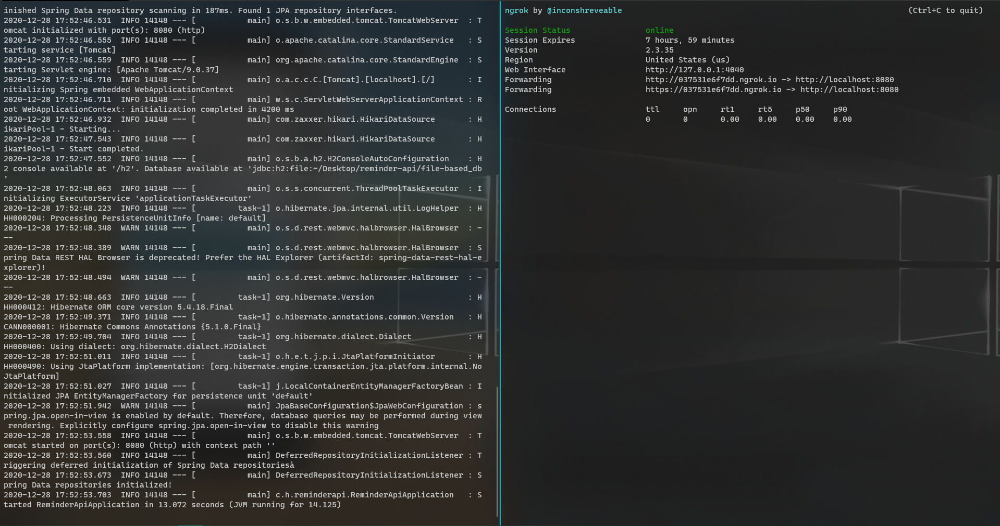
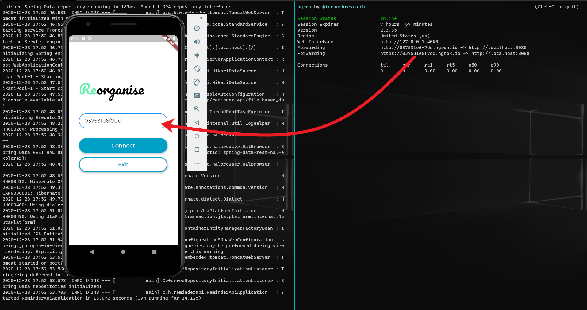
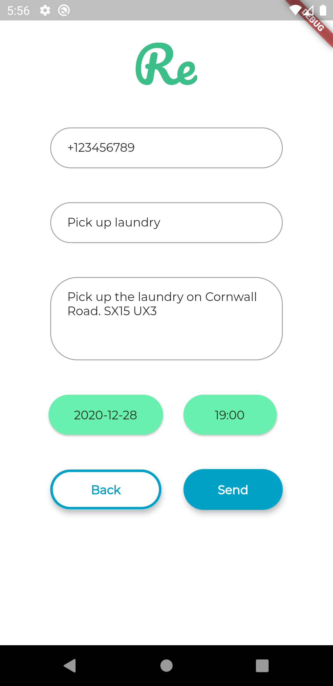
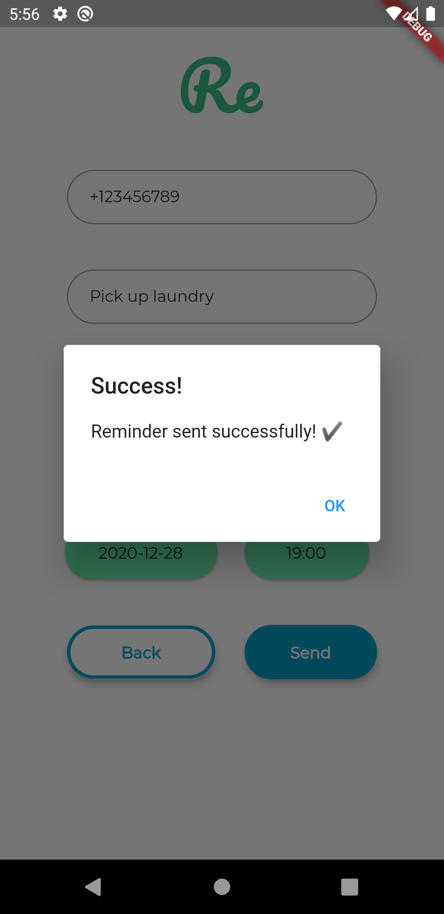

# Reminder API mobile client

(Re)minder, (Re)member, (Re)organise

Reminder API client for Android that communicates with [Reminder API](https://github.com/Horiapavel98/reminder-api-pub)

Depends on

* [Reminder API](https://github.com/Horiapavel98/reminder-api-pub) - Horia Pavel

Related to

* [Reminder API desktop client](https://github.com/Horiapavel98/reminder-api-client-pub) - Horia Pavel

## Requirements

Flutter SDK ✔

    [✓] Flutter (Channel beta, 1.25.0-8.1.pre, on Microsoft Windows [Version 10.0.18363.1256], locale en-US)
        • Flutter version 1.25.0-8.1.pre at C:\flutter
        • Framework revision 8f89f6505b (2 weeks ago), 2020-12-15 15:07:52 -0800
        • Engine revision 92ae191c17
        • Dart version 2.12.0 (build 2.12.0-133.2.beta)

Java 8 ✔

    • Java version OpenJDK Runtime Environment (build 1.8.0_242-release-1644-b01)

## Running locally 🏃‍♀️

Clone the repository, open an emulator or connect your Android device with your "Developer options " on. Have a look at how to turn developer options on [here](https://www.greenbot.com/article/2457986/how-to-enable-developer-options-on-your-android-phone-or-tablet.html).

To reveal your connected devices run

    flutter doctor -v

Accept Android licenses if needed and then run

    flutter run

## Build and deploy

To build the application for all the architectures run

    flutter build apk

Run the following command to split the apk by phone CPU architecture

    flutter build apk --split-per-abi

You will be able to see your phone CPU architecture using the `flutter doctor -v` command.

Once done, connect the device that you want to install the application on and then run:

    flutter install

## Description

Send reminders easily via SMS messages. Don't worry anymore, just send a reminder.

First on we need to start the Reminder API service and to tunnel it using `ngrok` as see in the image.

Now validate the required `ngrok` tunnel by inputting it's id in the `Tunnel ID` field ...

Input the tunnel id and hit connect to connect to the reminder service. Keep in mind that by default, [Reminder API](https://github.com/Horiapavel98/reminder-api-pub) runs on localhost port 8080. The port can be changed at will from the API props.

Next on we transition to the reminder screen.

Filling in the details             |  Confirmation
:-------------------------:|:-------------------------:
  |  

@Horiapavel98